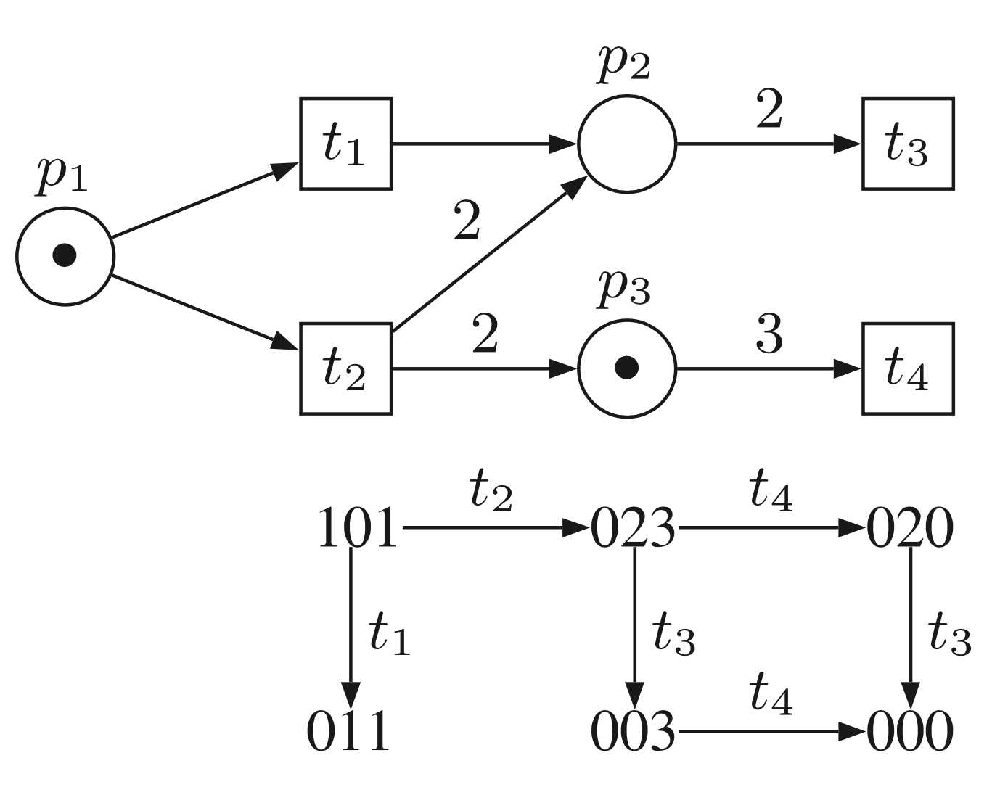
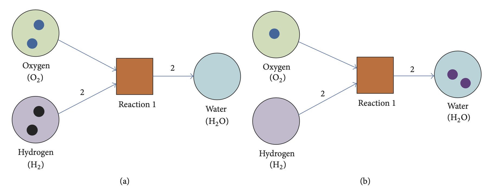

# Introduction

To cope with the inherent multi-physics and multi-scale natures of biochemical reactions, different levels of simulation detail have been adopted to investigate their dynamical behavior:

- **molecular dynamics** (MD): microscopic level - keeps track of the structures, positions, velocities as well as possible collisions of all molecules in the system. The MD simulation requires a very detailed knowledge of molecules in both time and space and a lot of computational power
- **Brownian dynamics** (BD): focuses on the dynamics of each individual species, but skips the molecular structure information. The movement of a species is described as a random walk (or Brownian walk) among point-like structures. The time scale of BD simulation is greatly improved over MD, but it is still limited when dealing with large models.
- **deterministic simulation**: highest coarse-grained approach which focuses on the macroscopic behavior of biochemical reactions. Molecular species in the deterministic simulation approach are represented by their concentrations. The rate of change in the concentration of each species due to a reaction is directly proportional to the concentrations of species involved in the reaction. The time evolution of a biochemical reaction network is described by a set of ordinary differential equations (ODEs). The deterministic simulation is fast; however, its underlying assumption inherently oversimplifies biological reactions in which populations of molecular species are continuous variables and their changes due to single reaction firings are assumed to be negligible. The correctness of deterministic simulation is severely affected when stochasticity plays an important role in the dynamical behavior of biochemical reactions.
- **stochastic simulation:** a mesoscopic approach to provide a probabilistic description of the time evolution of biochemical reactions. It keeps track of a discrete count for the population, but abstracts all the detailed position and velocity information, of each species. Each reaction in the network is assigned a non-negative chance to fire and to drive the system to a new state. The probability that a reaction occurs in a time interval is derived from the reaction kinetics. Each stochastic simulation step will select a reaction to fire according to its probability.

Although the stochastic simulation is faster than the MD/BD approach, it is often computationally demanding for simulating large biological systems. First, biochemical reactions, due to their multiscale nature, are separated by different time scales in which some fast reactions will occur at rates greater than other reactions. The fast reactions occur frequently and drive the system very fast into a stable state. The dynamical behavior of biochemical reactions, after the short fluctuation time at the beginning, will be determined by the dynamics of the slow reactions; however, most of the time the simulation samples the fast reactions to realize the dynamics which is not the expected behavior. Second, the population of some species involved in reactions may be larger than others by many orders of magnitude. The fluctuations of these species, when involving reactions fire, are less significant. Keeping track of large population species is obviously less efficient since a coarse-grained simulation method can be applied without loss of total simulation accuracy. Because of the inherent dynamics in biochemical reactions, a model can combine and mix all of these aspects in a very complicated manner. Third, due to the stochastic behavior in a single simulation, many simulation runs must be performed to ensure a statistical accuracy and this requires a high computational effort. These issues raise a computational challenge for developing and implementing efficient stochastic simulation methods.

# Network modeling

### Logic models

Recap from previous theory lecture:

What is the main issues in using logic modeling with multiple levels? The update formulae need to be defined for each level, tricky extension procedure. 

### Petri nets

**Petri nets** are specific networks introduced in 1960s, with the idea to  describe *communication processes* (computer science field). We have two kinds of nodes:

- ***places***  : container of entities
    - *tokens* : entities
- ***transitions*** : possibility to move one or more tokens to other places

In order to model a chemical reaction, we can associate places to variables, transitions to chemical transformations and tokens to molecules. 

PetriNets_SimaoEtAl.pdf

In the example we have numbers inserted in places. The network will evolve according to the transitions applied. A transition can be *enabled* or not to fire. E.g. there is one token in $p_1$, so we know that $t_1$ and $t_2$ are enabled. Instead, $t_4$ cannot be enabled, as 3 tokens are required but only one is present. $t_2$ is taking the token from $p_1$ and creating 2 tokens in $p_2$ and $p_3$;  this allows to fire $t_4$, since now $p_3$ has the required number of tokens.

(a) shows the initial marking before firing the enable transition t; (b) shows
the marking after transition labeled reaction 1 fires. Places: hydrogen, oxygen and water. We can represent the stoichiometry of the reaction through the numbers on the edges and the numbers to the tokens.

Review_ModelingComplexBiologicalSystems.pdf

Pros: we have no constraint on the data type, not strictly boolean values. They allow to extend the number of items which can be associated to a model. 

Cons: there is no fixed rule for applying transitions. Furthermore, we are not encoding the reaction’s complexity  (all transitions are equally probable, but it is possible to weight the edges).

Having a dynamics based on the integers can be quite useful, as if we consider single chemical events we are working with discrete data. The exact stochastic algorithm works with integers. In differential equations instead we need real numbers. Also the discretization of the time step might not be a limitation, since time can be discretized in reality. A huge approximation of the system is performed on time →  we do not have any clue of how much time is passing from one step to the other. We are assuming that all the reactions take the same (unknown) amount of time.

The main limitation of network models is the **approximation of time**, we have no clue on the time required for the reaction.

**Basic elements of a hybrid Petri net**

By upgrading the notation we can achieve more accurate representations:

- add inhibitory and test transitions
- differentiate between discrete and continuous transitions

## Rewriting systems

### P systems

Popular rewriting systems are ***P systems***, which are also called membrane systems. They are computational environment inspired to the structure and membranes. In particular, they define a hierarchy of membranes partitioning the space in different areas - similarly to a cell. In each regions we can allocate entities and apply transformation rules. The rewriting rules change the value of each letter. The pedix $_{in4}$ gives more details on the reaction. 

This kind of systems tend to use *non-determinism*, they try to explore the full set of possibilities.

### MP systems

The difference with standard P system is the association of functions to each reaction. In this way we can model the complexity of the reaction, since in the model we apply all possible reaction, which will produce an amount given by the function.

## Equation-based approach

### ODE systems

Example: mass-action model

$A+E \underset{k_2}{\overset{k_1}{\rightleftharpoons}} A \mid E \stackrel{k_3}{\longrightarrow} B+E$

## Simulation algorithms

For simulating we need a specification of stoichiometric matrix, a vector of integers (initial values) and stochastic rate. We will arrive to a formula with which we can compute the probability. ! reaction probability function is required for defining probability.

**Exact simulation algorithms** are computationally intensive, but provide the most accurate solution. Stepwise, we will try to define faster strategies with the aim of compromising accurate dynamics and feasible solutions. It is also possible to rely on a mixture of technologies to focus on different results.

If the well-mixed assumption is not fulfilled:

- partition the compartment in sub-compartments → approximation
- use more sophisticated algorithms

The *stoichiometric matrix* tells us how the system evolves if one of the two functions is applied, but it is not enough for computing a simulation. There can be many reactions that arrive to the same definition of stoichiometric matrix.

If we want to compute a dynamics  we need to develop a series of states; at each step we require two ingredients:

- $\tau$: tells how much later the system will evolve to another state
- $\mu$: choose the reaction by considering the probability of execution of each reaction at the step

**Reaction propensity:** function needed for the derivation of probability. The higher the propensity, the higher will be the strength of the reaction. Naturally, we will have a higher probability when a higher propensity is observed, but the two quantities are something different.

The propensity is a property of the reaction, probability is a property of a reaction in the system (we need to take into account also other reactions)

Instead of performing an in depth analysis of probability, we will choose a stochastic approach. It is only necessary to compute one evolution of the system per time.