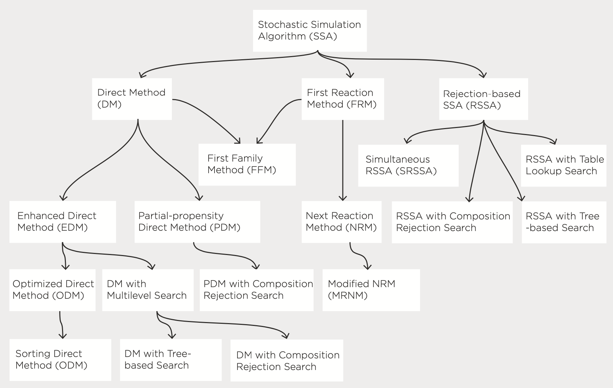
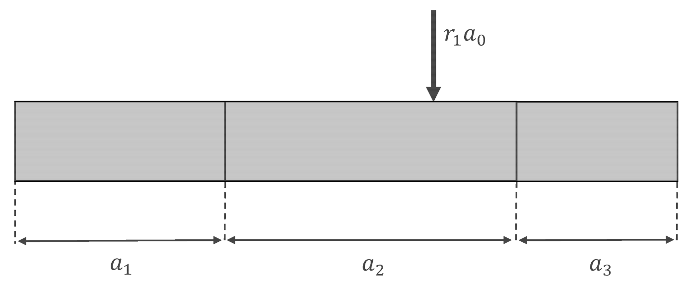
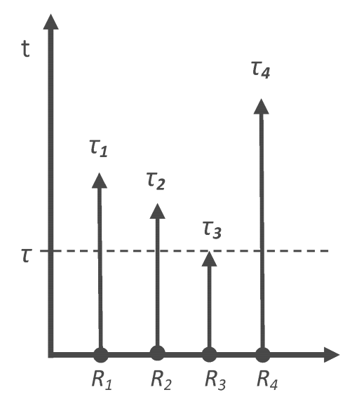

# 4- Network Modeling and Simulation

# Non-deterministic vs stochastic

Assumption: we are using the same model and parameters.

- Deterministic system: no randomness, we always obtain the same result.
- Non-deterministic system: there is some degree of uncertainty on different runs.
    - Exact stochastic simulation: satisfying some hypotheses, the system will behave just like a biological system. We are in a probabilistic setting. The fact that we are able to compute the probability function does not make this method deterministic, we have uncertainty. Theoretically, we could have no idea about reaction execution in a stochastic setting; in the case of exact stochastic simulation we reach a high level of accuracy thanks to the probability function.

Why do many computational environments employ a non-deterministic approach? Quite often we require to find the compromise between time and complexity. 

<aside>
 Non-deterministic polynomial time algorithms: we do not have an efficient solution, but it seems possible to find it.

</aside>

A non-deterministic setting allows us to understand whether an algorithm can be solved in polynomial time (stepwise guessing). Alan Turing realized that it was required to categorize algorithms with specific rules in order to compare them → Turing machine.

# Exact stochastic simulation algorithms

The direct method of Gillespie defined a couple of formulae able to understand how the system will execute in terms of time ($\tau$) and reactions ($\mu$). Since we are reasoning in infinitesimal time, each reaction occurs and ends exactly at time $\tau$, hence we cannot have multiple reactions firing simultaneously. 

Fig 3.1 Marchetti’s book

$a_0$ is the sum of all propensities in the system. 

1. We sample one random number from the distribution $a_0 = \sum_{j=1}^{M}{a_j} \rightarrow V_1=U(0,1)$
2. Scale it to the maximum $V_1 \cdot a_0 =U(0,a_0)$
3. See where this number will point over the different propensities
    
    
    
    Fig 3.2
    
4. Generate another random number $V_2 =U(0,1)$
5. $\tau \sim Exp(a_0)$
6. $\tau = \frac{1}{a_0}ln(\frac{1}{V_2})$

This algorithm can be improved by avoiding to recompute all the propensities, taking into account the fact that many reaction will keep the same probabilities over time. We can work on the complexity of the for loop through a dependency graph.

## Enhanced Direct Method

Our aim is to group reactions modifying at the same time in order to update propensities e.g. all reactions involving the same components. Let’s specify this concept in a formal way:

For each reaction $*R_j$* with  $j = 1,...,M$, define 
$Reactants(R_j)={S_i|S_i \ \text{is a reactant of } R_j}$,

and

$Products(R_j) = {S_i|S_i \text{ is a product of } R_j}.$

A **reaction dependency graph** …

We tend to have an improvement in time complexity when the graph is not highly connected, while the space complexity is higher (since we need to generate a data structure).

**Improvements for direct method:**

***Sort***: find the smallest index for which we can satisfy the condition for $\mu$.  On average, it is more efficient to keep reactions with highest probability at the beginning, such that we can easily match indexes to requirement. How can we compute the number of firings? We can set an oder beforehand based on previous knowledge or run a pre-simulation with a non-optimized algorithm (we still have a speed up since we are working with a smaller setting).

We cannot directly compute the propensity right away, as it heavily depends on the dynamics of the system, the state can change. It is required to compute some heuristics to sort the reaction order → standard Gillespie.

It is also possible to apply a ***multi-level search***. We group the reactions and select again a reaction in the group. As the dependency graph, here the issue is time complexity.

# First Reaction Method (FRM)

Instead of computing one $\tau$, compute a $\tau$  for each reaction. Example: $\tau_1 = Exp(a_1)=1/a_1ln(1/V_1)$. We are assuming that no other reactions are firing in the middle. We can generate M random numbers and end up with M $\tau$. Then we choose the reaction with minimum $\tau$, which will be the first selected one.

$\mu= R_{\mu} \text{ st } \tau_{\mu}  = \min_{j} \tau_j$

Pro: sometimes the search is quicker, simpler to parallelize

Cons: we generate a lot of random numbers with respect to the direct method.

After the first step, we need to recompute. Even here, there is the possibility to improve the algorithm e.g. computation of the propensity.

# First Family Method

Tries to combine the good features of the direct method with first reaction method. The idea is to reach an implementation which can be partially parallelizable: divide the reaction in “families” or groups. The idea is to divide the reaction in n groups  $r_1,…r_n$ and families e.g. 3 families. We should associate a theoretical propensity to each group, i.e. the sum of the propensity in the family $a^1=\sum_{j\in f_1}a_j$.

$FRM= \tau_1= \frac{1}{e^1}ln(\frac{1}{r_1})$, we do not know which one of the reactions will be applied. In order to  decide, we apply the direct reaction method formula for selecting the index. Given that we are working with a subset, we will scale over the sum, the $a_0$  of the group. It is true that we are generating random numbers, but over the number of the families → reduction. This time we have n families + 1 random number to select the family.  Danger: if we have big disequilibrium in propensity, we might end up selecting always one of the families. We can parallelize by linking families to CPU.

Last time, we were introducing Next Reaction Method, which can be considered as an evolution, trying to apply the same reasoning as FRM in a more efficient way (by applying an efficient  handling of random numbers). If we are able to do so we will need to compute less random numbers.

DM → $2 \cdot n_{steps}$

FRM →    $M \cdot n_{steps}$

FFM → $(n_{families} + 1)n_{steps}$

NRM → $M+n_{steps}$

If we take a look at the difference among methods, it is not very clear which is the winner - even though NRM seems to be one of the most optimized, it is usually the most efficient in requiring less random numbers. Of course everything has a price, we need to add computations. 

NRM is the most efficient in random number generation, while FRM is the one consuming the most.

# Next Reaction Method

Why do we need to recompute time points? Two issues:

1. multiple reactions can be executed at the same time → the reaction propensities might change
2. we are computing $\tau$ over propensities, but the propensities were computed on initial reaction settings. E.g. $R_2:A \rightarrow B$, $R_1 : A \rightarrow  B$ , the two reactions depend on each other.

$\tau$ is modelling the instant in which the reaction is assumed to fire, it is just an event. We can subtract the time for passing to following reactions, but we must also update the propensity. 

$a_1 \rightarrow a_1^{new}$, we have three possibilities:

1.  $a_1 = a_1^{new}$$R_2$ is not affecting the propensity, i.e. reactant is not modified by $R_2$, so $R_1$ remains unchanged.
2. $a_2^{new} > a_1$ . $R_2$ has been applied, something has changed and the firing prob of $R_1$ is increasing. Therefore, $\tau_1$  needs to be updated, we expect it to be smaller → rescaling through the ratio of the propensities e.g. $(\tau_1-\tau_2)  \cdot \frac{a_1}{a_1^{new}}$
3. $a_1^{new} < a_2$ higher  $\tau_1$

We should not think of another event, we are just updating the same event through the formula!

The algorithm was developed in the 2000s, there are a lot of improvements related to technology advancements. In addition to rescaling formula, there are other improvements to keep the complexity of the algorithm as low as possible:

- we avoid generating too many random numbers
- reaction dependency graph (introduced for Direct Method): recompute the propensity of the reaction only if it is needed
- searching the reaction: minimum is linear over the number of reactions. **Binary heap**: decrease to logarithmic scale, select winner in constant time.

Gibson 2000: original paper

Thanh 2014: latest algorithm

# RSSA

The Rejection-based Simulation Algorithm seems to be an approximation, but everything is exact. It tries to reduce computation complexity, but instead of limiting the amount of random numbers, it focuses on another bottleneck: the computation of the reaction propensity. The computational problem becomes more complex if we do not rely on mass action. 

The RSSA Algorithm therefore tries to reduce the number of times in which we compute the reaction propensity. We will need a placeholder and at the same time to keep the computation exact.

Instead of using the state of the system, we use a ***fluctuation interval*** (a bound). From the state of the system $X$ we generate a lower and upper bound; to do so, we just use a parameter providing a percentage, which is called $\delta$ ($0<\delta<1$). Therefore, the bounds will be computed as:

- lower $X = X - X \cdot \delta$
- upper $X = X + X \cdot \delta$

Given that the events of the reaction are modifying a few molecules per time, we can assume that for a certain amount of steps we will remain inside the same range of variability. We are trying to obtain a propensity computed over bounds; by doing so, we can apply the same computation for a higher number of steps, as we only need to recompute the propensity outside of the fluctuation interval. We can also compute the upper bound for the sum of the propensities $\bar{a}_0$. $a_1$ will be in the middle, but we do not want to compute it.

It seems like working with these bounds does not lead to an exact simulation: we need to avoid  as much as possible the exact computation of the propensities. Indeed, in the vast majority of cases we will have the possibility to choose the reaction without the real propensity. 

We will perform some computations and, given the presence of bounds, we will do some mistakes; the algorithm will evaluate the results and eventually reject them (rejection-based algorithm). For doing so, the algorithm generates the events with the upper bound of the propensity $\bar{a}_0$. By using an upper bound   $\tau$ will be lower, so we will generate more events with respect to the direct method. We apply a sort of Gillespie, we replace the standard propensity with the upper bound and choose the reaction as in the direct method. 

How can we understand whether an event is real or fake? In the case in which $\bar{a}_0 = a_0$ we are in the standard Gillespie. We should apply a similar reasoning as NRM for scaling for checking the validity of candidate reactions. Let’s imagine that we are selecting $R_2$: we should generate another random number, scale it over the bound and understand if we are in the exceeding (fake) or inside (real) area. 

- If the random number is lower than the lower bound, we can accept it without computing the real propensity.
- If the random number is between the bounds we require the exact propensity for discriminating:
    - $\underline{a}_2 < u < a_2$ accept
    - $a_2 < u < \bar{a}_2$ reject

The higher the fluctuation interval, the higher the uncertainty but lower the complexity → find the right compromise with some heuristics on  $\delta$ value.