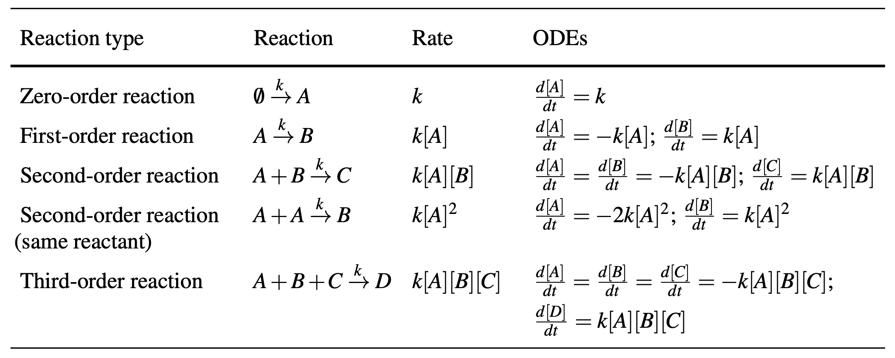
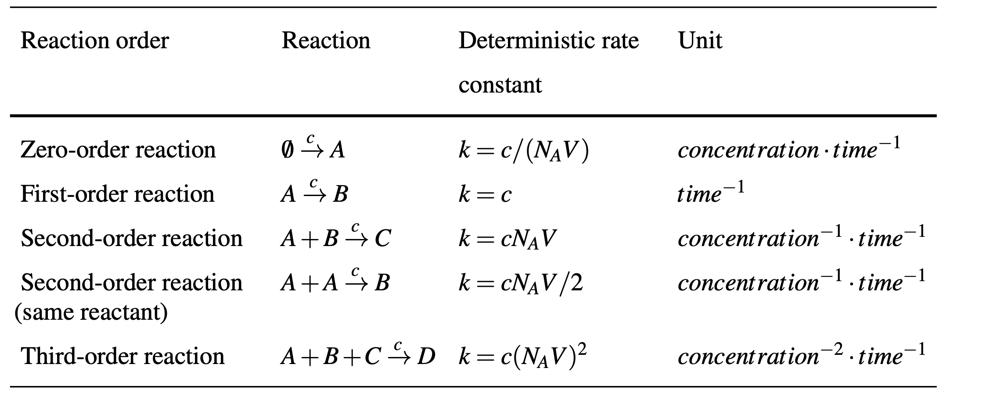

# Deterministic simulations

A *deterministic* way of calculating the dynamics of a system, when the last (noise)
term of CLM equation becomes negligibly small compared with the second one, can
be applied. This happens in the limiting case $*a_j(\mathbf{x})τ → ∞*$, $*j = 1,...,M*$, and the
deterministic simulation produces an average behaviour of the system that is very
close to the one that results by averaging an infinite number of stochastic simulations
of the system starting from the same initial state. If we work in terms of *moles*, we are moving Avogrado numbers; it is not so distant from the reaction size, the assumption is correct enough. The deterministic simulations should give as an output the same result as an average stochastic simulation.

ODEs can be safely used to simulate a biochemical system that satisfies the spatial homogeneity and continuum hypothesis.

**Continuum hypothesis: “**A biochemical system satisfies the continuum hypothesis if the number of molecules for each species is large enough to safely approximate molecular abundances by concentrations that vary continuously (as opposed to integer- valued molecule counts).”

Sometimes, models simply use the ODE formalism, regardless of the hypothesis (since the ODE is the only computational framework allowing to reach the end of the simulation).

We are required to apply conversions and derive the ODE according to the following table:



Table 4.4 Marchetti’s book

Here we are not considering the combination of the reactants. c = stochastic rate, k = deterministic rate. 



Table 4.5 Marchetti’s book

It is possible to go back to the stochastic setting from the deterministic one.

CLM equation: if we assume that the product is crazily high i.e. close to infinite, we can assume that the two parts of the equations have different orders; in this specific condition, the noise part becomes negligible.

# Deterministic approximation

If the propensity is approaching infinite, we can assume that the deterministic setting is motivated. We are required to introduce the law of mass action and employ tables [last lecture] to derive a set of ODEs. In this context, the law of mass action is a bit different from what we have observed at the beginning of the course. We need to remember that the constant of proportionality, i.e. rate, is not the same as the stochastic setting.

$$

```
				\\frac{d[S_i]}{dt} = \\sum^M_{j=1}(					 k_j\\mathbf{v}_{ji} \\prod^{N}_{l=1}{[S_l^{\\mathbf{v}^{-}_{jl}}]})			,i = 1,...,N.

```

$$

The equation  $\frac{d[S_i]}{dt}$  should represent a molar concentration over time. We have an equation for each of the species $i=1,…,N$. It should take into consideration the effect of all substances in the system → sum over $M$, considering all reactions, which will be multiplied by the stoichiometric index. The system is computed as $k$ (constant of proportionality), stoichiometric index and the product of all the reactants. If a species is not a reactant, $S_i=0$, we end up with 1, only product of the reactants.

$$
\frac{d[A]}{dt} = - \frac{d[B]}{dt}= -V_{MAX} \cdot \frac{[A]}{K_M+[A]}
$$

We can just rely on a simplified set of equations to avid mass action correspondence. $V_{MAX}$ = maximum velocity of the enzymatic reactions, $K_m$, called *Michaelis constant*, indicates the concentration of the substrate at which the reaction rate is half of its maximum value.

# Numerical solution of ODEs

Often times in computational biology  it is unlikely to have enough power for deriving an analytical solution of the system, reality is different and the complexity prevents this kind of approach. Therefore we rely on numerical methods to compute the simulation, adding an additional layer of approximation. The algorithm uses the idea of derivative to understand the next value.
For a value of t>0, the level of approximation could be remarkable and depends on the dynamics of the system.

Remember that when we simulate in time we have the issue that the computation of the next state depends on the previous state: we are dealing with an iterative formula, so potentially we can have a huge error explosion. At the basis of such method is the concept of derivative and geometrical rule to identify next step; Euler’s method is the simplest one.

## Euler’s method

The first examples of explicit/implicit numerical methods are the *forward Euler
method/backward Euler method* for updating the system state:

- Forward Euler: $[X_{n+1}] = [X_n]+h·F(t_n,[X_n])$
- Backward Euler: $[X_{n+1}] = [X_n]+h·F(t_{n+1},[X_{n+1}])$

Not surprisingly, for increasing the order of the algorithm we will require a more accurate approx of the derivative, translating in additional evaluation of the ODE.

## RUNGE-KUTTA Method

RK4 is a 4th order method, good compromise in accuracy and computational requirements. This algorithm uses a sort of average over Ks, which are computed by solving the set of ODEs as following:

$*K1 = F(t_n,[X_n])\\ K2 = F(t_n + 2h,[X_n]+ h2K_1)*$

$*K3 = F(t_n + h2,[X_n]+ h2K_2)\\
K4 = F(t_{n+1},[X_n]+h·K_3)*$

Is it possible to increase accuracy without increasing complexity?

“[entra una ragazza in classe, dice “ups”, esce imbarazzata perché ha sbagliato aula] M: ahaha. SERIO,DETERMINISTICO”

## Midpoint method

2nd order method, we compute the new state at line 5 by two elements: x the current state and x old (the previous one). In this case, the multi-step method links the increased order to the number of step previously considered to compute the slope.

Drawback: what happens in the first step? We require an initial state and and additional time series!

Limitation of multi-step algorithms: they all require a discretization step, it rules the movement. The time should not be computed during the iteration, chosen from the beginning; if we think about this, it can be a limitation of the application of the methodologies, which ask the user an information which might be unknown. Which is the right time for simulating? Of course we can try to keep the discretization step as small as possible, but the right question that should be asked is: which is the error value? Keeping the error below a certain threshold is not easy, since the dynamics evolve with the system. In order to achieve error control, we should apply more requirements to discretization, leading us to seek an *adaptive solution*.

In order to derive a rough estimate of the error we should compare the state computed by two algorithms of different order: one should be more accurate than the other, to have an idea of the degree of approximation.

## Adaptive methods - Runge-Kutta-Fehlberg

“Strapopular algorithm: Runge-Kutta-Fehlberg, RK45 for friends”.

**RK45:** two methods, 4th and 5th order to apply error evaluation [4th for dynamics, 5th for estimating the error]. The algorithm will scale the step (h), in such a way that we keep the deviation below an error threshold. A formula will allow to play with h according to the deviation (increase if deviation is little).

Recall that for the 5th order we require 6 derivations. The two methods are similar, they share the same Ks, therefore at the price of computing a fifth order method we will have the possibility to obtain two evaluations → quite efficient method. ODE45 is this algorithm!

Error computation: $\Delta_{n+1}=\frac{|[\tilde{X}*{n+1}]-[X*{n+1}]|}{h}$

The error estimate is then compared to the error threshold 					$ε_t$ provided by the user. If $Δ_{n+1} ≤ ε_t$, the local truncation error is assumed to be smaller than the threshold, the state $[X_{n+1}]$ is accepted and the algorithm moves one step forward. In the other case, the new state is not accepted and the next state is evaluated again using a different (smaller) value of h. In both cases, the value of h is updated as

$$
h_{n+1}=h_n\sigma \\ \sigma =(\frac{ε_t}{2\Delta_{n+1}})^{1/4}
$$

Issue: it’s possible that for specific dynamics we will need an infinitesimal h to satisfy the error threshold. We can avoid this by updating the strategy, for instance impose an additional threshold to h or insert an heuristic.


Figure 4.9. Value of h used at each step

We can end up in situations in which the system changes a lot → *stiffness condition*, if we work with an adaptive method the property of the dynamics leads to instability in deriving the discretization step. Stiffness is a couple property of ODEs and the numerical scheme used to solve the system. This means that the same system of ODEs may exhibit stiffness only when it is simulated with some of the numerical schemes introduced in this chapter. In MATLAB we can use ODE15S in case of stiffness (happens quite often in biology simulations).