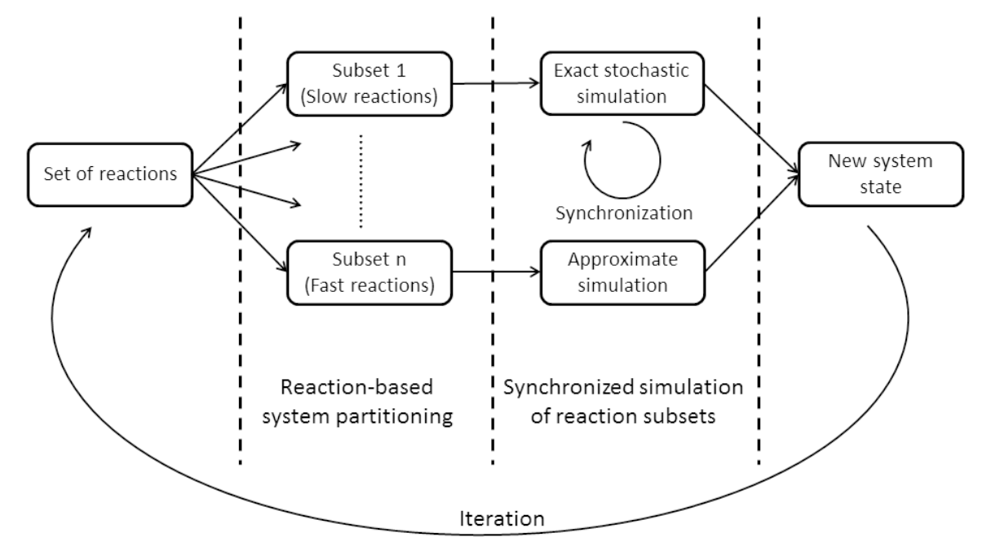
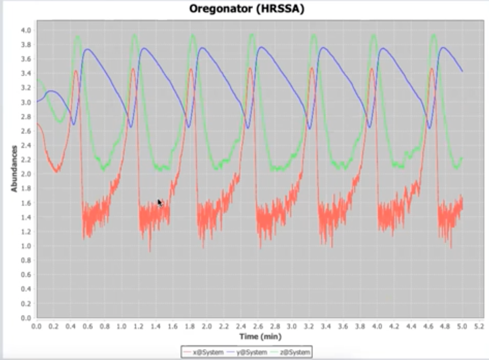

# Hybrid simulation approaches

Hybrid simulation combines the advantages of complementary simulation approaches: a system is partitioned into subsystems that are simulated with different methods.

Sometimes we need to make a consistent choice for the complete model, but often (especially in biology) the model can incorporate many different situations. For instance, not all species will be present in low or high amounts. We cannot simulate with exact simulation strategies due to complexity, but at the same time for some parts of the network relying on approximation is too much and we risk losing some important details.

We need to identify the qualities of the system that should be linked to a specific degree of approximation. When is it particularly dangerous to simulate deterministically? For instance, when rare events can occur: the stochastic nature of reaction firing cannot be fully modelled by deterministic setting. If the firing probability is lower than a threshold, we can assume that it is rare → intrinsically stochastic. We can divide reactions according to their firing probability, apply a rule over the propensity.

If instead we focus on variables, we can select abundance levels: in case of low abundance, the stochasticity over the average is providing an important part of the behaviour. Usually, reactions with low propensity are also the ones modifying low abundance species. In highly abundant species, the contribution of noise is reduced.

- low number species and slow reactions → exact stochastic simulation
- high numbered species and fast reactions → approximation

In this scheme we are trying to map the algorithms that we have already seen together, we are still not creating an hybrid method. Keep in mind that the availability of species can change along the trajectory. It is particularly difficult to make a consistent choice, therefore the hybrid setting is generally preferable in this case.


We need to partition the set of chemical reactions in subgroups in which we find consistent properties. Once the groups are established, we should be able to simulate the system in different settings. 

The main assumption in the tau leaping method is that the propensity of the reaction will not change dramatically during the macrostep; if we apply this concept to the hybrid setting we will see that this is an issue, as groups are not disjoined.



# Reaction-Based System Partitioning

In order to divide reactions into group we can set up a threshold, which could be computed over the product of the propensity of the state and the simulation step. If the product is higher or lower than the threshold, we can identify the reaction as rare or probable. 

Example of partitioning algorithm: *two class reaction-based partitioning*. Divide reactions in slow and fast through an iterative loop.

In general, we can increase the complexity of such approach as much as we want. Example: *four class reaction based partitioning*, we can bridge more simulation strategies. 

In Algorithm 45 the four class partitioning is applied; at the very beginning we impose a time step e.g. with tau leaping, compute the partitioning ending up with 4 sets (very slow, slow, medium and fast). For any of the reactions we will apply different strategies, for instance in the case of the very slow we require exact stochastic simulation. For sure the simulation will be more accurate, but we cannot claim that the simulation is exact, since we are only working on a set of reactions, not on the full system. If we wish to have an exact algorithm, we should consider the problem of **time varying reaction propensity**. 

If we want to be able to appropriately generate time, we should move considering the integral of the propensity over the time and the random number. We can consider the zero crossing of an equation as following (the log of the random number is a negative quantity):

$$
\int_t^{t+\tau} a_0^s (X(t')) dt' = - \ln(r)
$$

Instead of deciding  $\tau$ at the beginning, the time will be computed along the approximation; when the quantity will be equal to zero, the approximation will stop and restart. We can consider this as a sort of traffic light: an event is generated, green light, we can move one.

The real issue is that even if we have an equation to find the right time, being able to compute this requirement exactly with a computational strategy is a problem. The approach to zero will be affected by a variety of steps, e.g. the computer has a certain threshold for the zero. In addition computing the integral is computationally challenging.

1. non trivial complexity, integrals tend to be approximated by computers
2. the zero crossing is affected by approximation error

If we use deterministic simulation for simulating fast reactions, we can add another equation to understand when it is the time to stop during the simulation. We start from the logarithm of the random number and proceed with numerical integration.

$$
\frac{dRES}{t} = a_0^x,RES(0)= \ln(r)
$$

Synchronization has a price: the more complex, the higher impact we will have on the right time. Can we do something better? We can apply an extension of RSSA to obtain better results.

# HRSSA

This algorithm claims to be exact and was developed by Marchetti. 

In RSSA we have a side effect: $\tau$ is computed over an *upper bound*, therefore we no longer need to reason in terms of propensity varying in time. By taking this perspective, we totally avoid slow events, just focus on upper bound. 

We have two main issues in this strategy:

1. by considering an upper bound we will generate more events
2. the bounds should be satisfied, therefore along the simulations we will need to check the  consistency over the fluctuation interval of the state

We have no need of computing the integral, we work with fluctuation intervals and link the generation of $\tau$ over this quantity, with the only difference that we only consider the upper bound and not the current value.

Pseudocode: we start from a while loop, we compute the fluctuation interval, the bounds of the propensity (same as RSSA) and move forward with $\tau$ computation. When we reach $\tau$ we decide to apply or not the reaction through random number generation. The main issue is how to compute the reaction partitioning, in this case the algorithm divide into slow and fast. Since we are working with bounds, we substitute the real propensity with the lower bound for performing the partitioning. Given that the partitioning is computed on the bound, it is just necessary to compute it again for each interval → speed up.

 When the system is very complex, it is often not possible to apply this algorithm


### HSimulator

Simulator prototype (Java) developed by Marchetti to try HRSSA.

```bash
java -jar HSimulator.jar
```

We simply provide the set of reactions in arrow notation, same specification as MATLAB. The simulations provided are DM, RSSA, Euler, RK45 and HRSSA. We have the possibility to define simulation length and time sampling i.e. sampling over which the time series is stored.




Oregonator HRSSA: the algorithm applies the stochastic approach by starting from the deterministic setting. In the advanced options we can insert additional specifications].

If we apply steady state conditions (simulation length = 5, time sampling = 0.0001), we observe a flat signal; the issue is that the stochastic simulation is applied to the subset of slow reactions. If we change the parameters for deciding if something is fast or slow, we should see a change in the behaviour. 

“Un giorno o l’altro mi ammazzerò, ne sono certo”

By working with smaller variables, we see something remarkable: noise is heavily present.